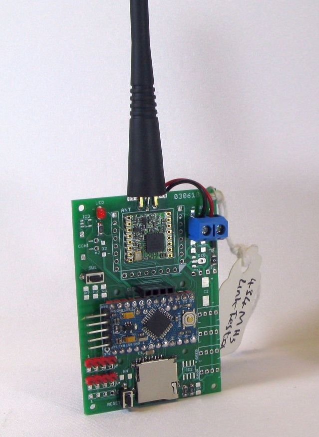
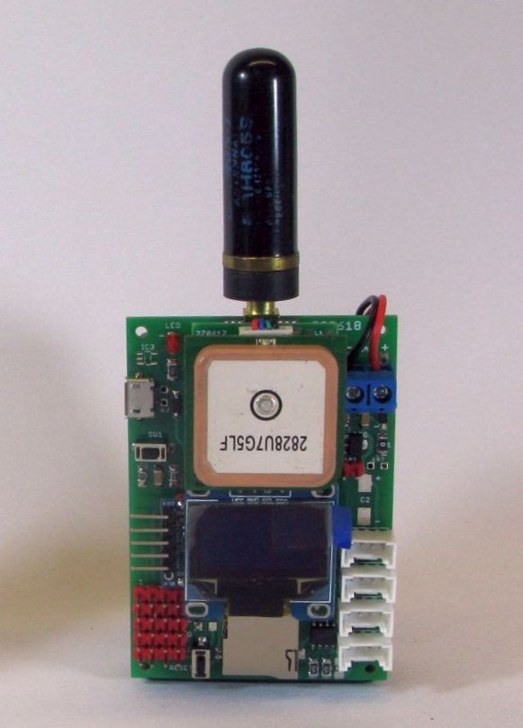
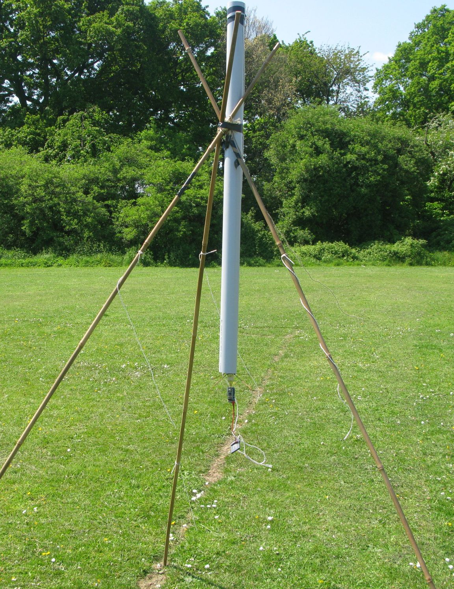
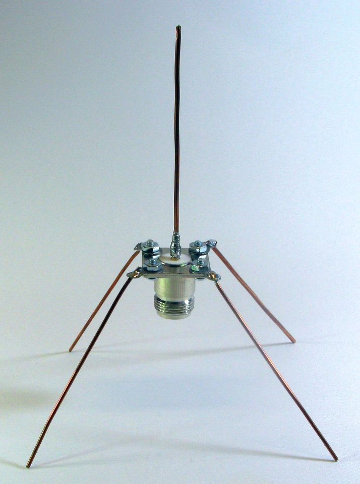
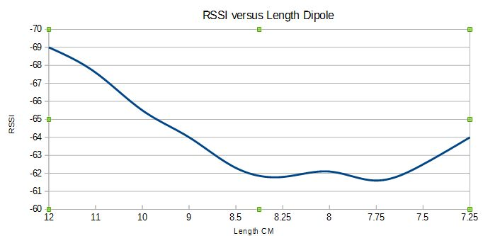
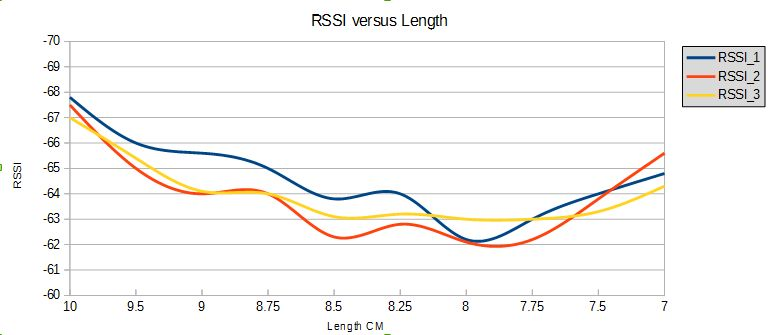

## Testing antennas is easy.

Really it is. 

The prime objective of an antenna is to radiate the maximum amount of power in the direction of choice. A secondary objective is to match the transmitter output impedance to the antenna so that minimum power is reflected back into the transmitter as excess reflected power can damage a transmitter.

For our low power, typically less than 100mW, Internet of Things devices, in order to maximise range (distance) we normally concentrate on maximising radiated power rather than obsessing about antenna matching. We still do, however, need to be confident that a reasonable antenna is attached, even low power LoRa devices can be damaged if they transmit with no antenna or one that is defective. 

There is great deal of theory to understand about antennas, many sophisticated and complex charts you draw and some very capable simulation tools. You also can write many thousands of words describing how good an antenna is. There are fancy antenna gizmo's that allow precise measurements of an antennas standing wave ratio (SWR) and measurements of the resonant frequency of the antenna. The stark truth however is that none of this sophistication and time spent tells you how the antenna performs in the real world. 

It seems often to be the case that this is not appreciated, I have seen a great many forum posts and professional presentations with a great many charts, simulations and tests with fancy antenna gizmos etc. But ask the question 'what is the real world performance of the antenna ?' and very often you don't get a convincing answer, maybe its just me being picky though.

I have a fancy antenna gizmo (VNA - vector network analyser) and it's great for setting up or fine tuning an antenna, but apart from that bit of technology I don't bother with charts or simulations, I just check the actual performance, its what I really want to know after all. And you don't need a VNA to tune an antenna either. 

It should be understood that absolute measurements of antenna performance are a challenge. It can be difficult and time consuming to measure the actual gain of an antenna in every direction. However apart from potential dodgy sellers on eBay and Aliexpress, 99.99999% of the time we do not need to know the absolute performance on an antenna, we just need to know the comparative performance between different antennas, which one in best, and how much better is one than another or in relation to a reference. Its this comparison that is easy. When setting up our tests we just need to make sure that the only variable or thing that changes in the tests is the antennas themselves. If the transmitter, receiver, location, height etc of the components used during a test stay the same, then a difference in test results will be due to the differences in the antennas.

For most IOT type applications we want the transmitter to radiate maximum power in a horizontal direction, more or less parallel with the ground. Its true that if an transmit antenna is on a tall building and the receive antenna is close then the path from transmit to receive is pointing steeply downwards and not parallel to the ground. However the receiver is normally close so that fact that the antenna may actually be radiating parallel to the ground does not cause issues. As the receiver gets a long distance from the transmitter, then the path between them will be close to parallel to the ground. 

Therefore, to measure an antennas performance we can simulate (or be very close to) the real world situation in a large flat open area. A large playing field is good, as long as you are maybe 100m or so from trees or buildings which could affect our tests, I use a local playing field, see the picture below. 

So we have an antenna to test, what next ? 

We need a transmitter and antenna to radiate a signal on the chosen frequency, fortunately for the low cost Semtech SX127x based LoRa modules can do just this, they can transmit a radio frequency carrier at a chosen frequency at a power level of between 2dBm and 20dBm. See below for a basic transmitter, its a simple PCB with LoRa module, Arduino Pro Mini and a battery pack can be fixed to the rear;

The board takes a single Mikrobus socket and a RFM9x LoRa module can be fitted direct. There are options for I\O and Grove connectors, MicroSD card and low quiescent current regulator. The boards can be bought in pairs from http://www.LoRaTracker.uk, but any 3.3V Arduino will do with the appropriate connectors.   

Next we need a way of measuring the signal strength some distance away from the transmitter. We can also do this with a LoRa module, see below the same PCB as above with a display added;

If we don't have a display we can send the output to a serial terminal program on a PC. 

A more conventional way of reading signal strength may be with a spectrum analyser, either bench type or portable, although the portable type is a lot more convenient to use out of doors, see the RF Explorer below for an example;

So we have our transmitter and receiver sorted. Another simple examples of what we can use is below, its one of my LoRaTracker boards; 

### Loading the Programs

There are two programs to load the ping tone transmitter;
##### Ping\_Tone_Transmitter.ino

  

And the matching RSSI meters;

##### RSSI\_Tone\_Meter_SSD1306

For an Arduino with an SSD1306 OLED display.

##### RSSI\_Tone\_Meter_SSD1306

For an Arduino with an 20x4 LCD display and PCF8574 adapter. 

These programs are found in the \programs directory of this repository. The programs were tested with version 1.8.5 of the Arduino IDE, the transmitter and receiver were both powered by Arduino Pro Minis, 3.3V and 8Mhz.The use of 3.3V Pro Mini avoids the need for logic level translation on the LoRa device.  

The RSSI meter program can be used by reading just the serial monitor output but its far more convenient to use one of the display options for a hand-held portable device, either an SSD1306 OLED or a 20x4 3.3V LCD run via a PCF8574 I2C expander.  

The Transmitter (I call it the Ping Transmitter) is loaded with the Ping\_Transmitter_251118.ino Arduino program that sends out a burst of carrier at the set frequency in approximately 3 second bursts with a gap in between. If the frequency is in the 434Mhz region we can listen for it on a UHF hand-held, or a low cost software defined radio attached to a PC\Laptop.

The frequency (in hertz) of the transmissions is set by this line in the "Test_Settings.h" file;

const unsigned long Frequency = 434400000;        //frequency of transmission

There are settings for a calibration offset, to compensate for any frequency error of a particular module, normally you can leave it at zero. You can set the transmit power in dBm and some parameters for the tone transmitted. At program startup the LoRa module is checked, if its not found the LED will flash very rapidly. When the tone is actually being transmitted the LED is on. 

The Ping receiver software is in two versions "RSSI_Meter_LCD.ino" for the 20x4 LCD attached via a PCF8574 I2C IO expander and RSSI_Meter_SS1306.ino" for a SSD1306 OLED display. 

The receivers are set to the same frequency as the Ping Transmitter and the receiver then uses the RSSI function of the LoRa device to read the received signal and averages the readings for display. The configuration for the RSSI Meter settings are made in that programs "Test_Settings.h" file. 

The transmitter and receiver (with antennas attached) can be simply taped to a thick bamboo pole and pushed in the ground, maybe 50M apart. Here is a test transmitter on another antenna testing range I have used, Tenby beach'

Alternatively its easy to make a tall tripod from three thick bamboo poles and hang the transmitter and antenna from the middle see,picture;

In the above picture I was testing the de-tuning affect of a plastic pipe on the antenna. The actual transmitter and battery is hanging off the bottom.

We are using wood\bamboo poles as we don't want any metal nearby to affect our antennas. 

At this point we are set-up to measure the output power from the transmitter and its antenna, but what does the measurement we are seeing, say an RSSI reading of -60dBm, actually mean ? 

If we had a reference antenna, which we will call it antenna A we could swap antennas on the transmitter and compare the reference with our antenna of interest which we call antenna B. Swapping antennas is quick so the comparison is quick too. 

For a reference antenna (A) , build a 1/4 wave vertical with radials, see picture, this is an 868Mhz antenna. 

This antenna is easy to build and difficult to get wrong, if the length of the centre vertical and radial are all 1/4 wave at the frequency of interest, then the performance should be predictable and it can act as our reference. 

The process is now that we first measure our reference antenna (A) and say the result is -60dBm average at the remote receiver. If we swap antennas and the measurement for B is now -57dBm then we know that antenna B has 3dBm gain over antenna A (our reference). 

The reference antenna should have a gain close to 2dBi,so if the B antenna is 3dBm better it ought to be a 5dBi antenna. 

If we have a range of different antennas, say C, D and maybe E, its the work of a couple of minutes to test their comparative performance.

In practice the relative performance (to the reference) is all we need to know, as we know whether the antenna under test performs well or not, there is no particular need to any further testing.

Once we have this simple testing range set-up, we can use it to trim or tune antennas too. For instance if we build a reference antenna type (see above) we can build it with wires that are say 50% longer than calculation suggests. This with a suitable assistant (or a lot of walking) we can trim short bits off the antenna wires and measure the effect with our receiver. Record the results, plot a graph and it can look like this, it shows the effect on radiated power as a 868Mhz dipole is trimmed to length;

Note that maximum radiated power occurs at around 7.75cm. Note that this is different to the length that calculations for a 868Mhz dipole suggest, which is 8.68cm. At the so called 'correct' length the antenna actually radiates about 1.5dBm less than the optimum length, so there is an improvement gained of 1.5dBm in performance by carrying out a real world tuning test. 

The LoRa modules do vary slightly in their output impedance, see the result of tuning dipoles of 3 separate LoRa modules;

Note that each module has a slightly different optimum length, but all are shorter than what a theoretical calculation suggests (8.68cm). 

### A cautionary tale

If there are still sceptics of the benefit of practical testing, a cautionary tale. 

I had built a 868Mhz co-linear antenna based on plans where the design had been professionally modelled for optimum performance. After a bit of adjustment it peaked dead on 868Mhz and had a SWR less than 1.1, all this measured with a fancy antenna tuning gizmo. The real world performance however was dreadful, it emitted some 3dBm less than a simple 1/4 wave with radials. And this is the point really, fancy antenna gizmos cannot tell you how an antenna performs for real .......................... 

### Stuart Robinson

### www.LoRaTracker.uk

     